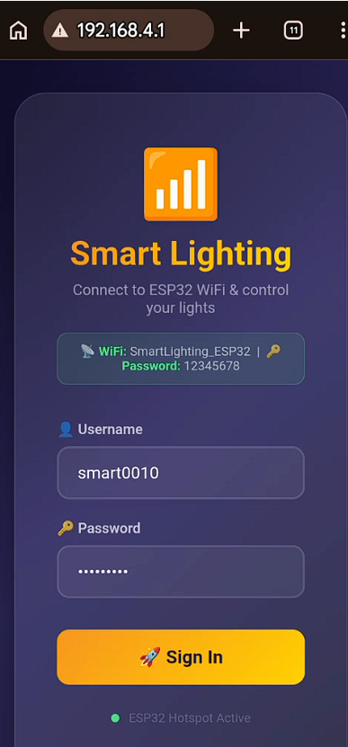
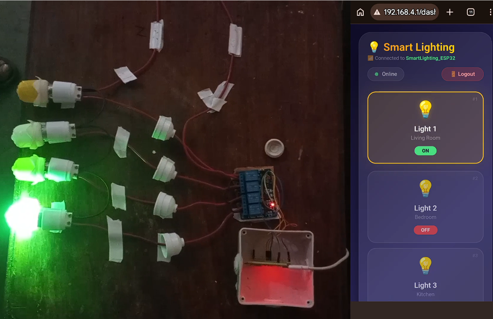

# ESP32-Based Smart Lighting Control System

A cost-effective, IoT-based smart lighting control system using an ESP32-S3 microcontroller with a built-in Wi-Fi Access Point and web server. Lights are controlled directly from any browser — no companion mobile app or external broker required.

## 🕓 Project History
The original version of this project — [muhammaddaniyal0020/ESP32-Smart-Lighting](https://github.com/muhammaddaniyal0020/ESP32-Smart-Lighting) — used the **MQTT protocol** for messaging together with a **Flutter mobile app** (Android & iOS) as the client, communicating over topics such as `home/light/1/command` and relying on the `PubSubClient` library on the ESP32 side.

**Dua Bukhari** ([@syeda-duaa](https://github.com/syeda-duaa)) later redesigned the project into the current **web-based client-server architecture**. MQTT and the Flutter app were replaced with an ESP32-hosted Wi-Fi Access Point and built-in web server, so lights are now controlled from any browser over plain HTTP requests instead of a dedicated mobile app and message broker.

## 🚀 Features
- **Individual Light Control**: Control 4 separate lights independently
- **Master Controls**: Turn all lights ON/OFF with one tap
- **Real-time Feedback**: Live status polling of all lights
- **Browser-Based Client**: Works on any device with a web browser (phone, tablet, laptop) — no app install needed
- **Standalone Wi-Fi Access Point**: ESP32 hosts its own hotspot, no home router or internet required
- **Login Authentication**: Username/password protected dashboard with session timeout
- **HTTP-Based Communication**: Lightweight REST-style endpoints served directly by the ESP32
- **Cost-Effective**: Total system cost under $30

## 🛠️ Hardware Components
| Component | Model | Quantity |
|-----------|-------|----------|
| ESP32-S3 | WROOM-1-N16R8 | 1 |
| 4-Channel Relay Module | SRD-05VDC-SL-C | 1 |
| LED Bulbs | Standard 220V AC | 4 |
| Bulb Holders | E27 Socket | 4 |
| Power Supply | 5V 2A | 1 |
| Jumper Wires | F-F 20cm | 15 |
| AC Cable | 3-core 18 AWG | 5m |
| Junction Box | Plastic | 1 |

## 📋 Pin Configuration
> **Note:** Pin assignments were updated for ESP32-S3 compatibility. GPIO 26–32 are reserved for flash/PSRAM on this variant and must be avoided.

| ESP32-S3 Pin | Relay Module | Description |
|--------------|--------------|-------------|
| 5V | VCC | Power for Relay Coils |
| GND | GND | Common Ground |
| GPIO1 | IN1 | Light 1 (Living Room) |
| GPIO2 | IN2 | Light 2 (Bedroom) |
| GPIO3 | IN3 | Light 3 (Kitchen) |
| GPIO4 | IN4 | Light 4 (Study Room) |

## 🏗️ System Architecture
The system now runs as a **self-hosted client-server web application** instead of an MQTT + Flutter app setup:

- **Server**: The ESP32-S3 runs in Wi-Fi Access Point (AP) mode and hosts a lightweight web server (`WebServer.h`).
- **Client**: Any browser connects to the ESP32's hotspot and loads the login page and dashboard served directly from the device — no separate mobile app to build or install.
- **Communication**: Plain HTTP GET/POST requests replace MQTT publish/subscribe messaging.

## 🌐 Web Server Endpoints
| Endpoint | Method | Purpose |
|----------|--------|---------|
| `/` | GET | Serves the login page |
| `/login` | POST | Authenticates user (`username`, `password`) |
| `/dashboard` | GET | Serves the light control dashboard (requires active session) |
| `/toggle?id=<1-4>` | GET | Toggles the specified light on/off |
| `/all?state=ON\|OFF` | GET | Turns all lights ON or OFF |
| `/states` | GET | Returns current light states and auth status as JSON |
| `/logout` | GET | Ends the current session |

## 🔐 Access & Login
| Setting | Value |
|---------|-------|
| Wi-Fi SSID | `SmartLighting_ESP32` |
| Wi-Fi Password | `12345678` |
| Dashboard URL | `http://192.168.4.1` |
| Username | `smart0010` |
| Password | `smart0020` |
| Session Timeout | 1 hour (auto-logout) |

## 📱 Client Screenshots
| Login Page | Dashboard |
|:----------:|:---------:|
|  |  |

## 🔧 Installation
### ESP32 Setup
1. Install Arduino IDE
2. Install ESP32 board support (ESP32-S3)
3. Open `Smart_Lighting_System_Client-Server_Code.ino`
4. Verify/adjust GPIO pin assignments if your wiring differs
5. Upload the code to the ESP32-S3
6. On boot, the ESP32 creates its own Wi-Fi hotspot and starts the web server

### Connecting from a Client Device
1. On your phone or laptop, join the Wi-Fi network `SmartLighting_ESP32`
2. Open a browser and go to `http://192.168.4.1`
3. Log in with the credentials above
4. Control lights directly from the dashboard — no app installation required

## 📊 Performance Metrics
| Metric | Value |
|--------|-------|
| Average Response Time | 225 ms |
| HTTP Request Size | 15-50 bytes |
| Wi-Fi Range | 30 meters |
| Connection Stability | >99% uptime |

## 📝 License
This project is licensed under the MIT License - see the [LICENSE](LICENSE) file for details.

## 👨‍💻 Authors
- **Muhammad Daniyal** - Roll No. 62413
- **Bushra Javed** - Roll No. 62313
- **Dua Bukhari** - Roll No. 62301 - [GitHub: @syeda-duaa](https://github.com/syeda-duaa)

## 🙏 Acknowledgments
- **Madam Shehr Bano** - Supervisor
- **Madam Nosheen Jelani** - Co-Supervisor
- **Institute of Computational Intelligence, Gomal University**

## 📚 References
1. Espressif Systems. (2024). "ESP32 Technical Reference Manual"
2. Espressif Systems. (2024). "ESP32 Arduino WebServer Library Documentation"
3. Mozilla Developer Network. (2024). "HTTP Request Methods"
